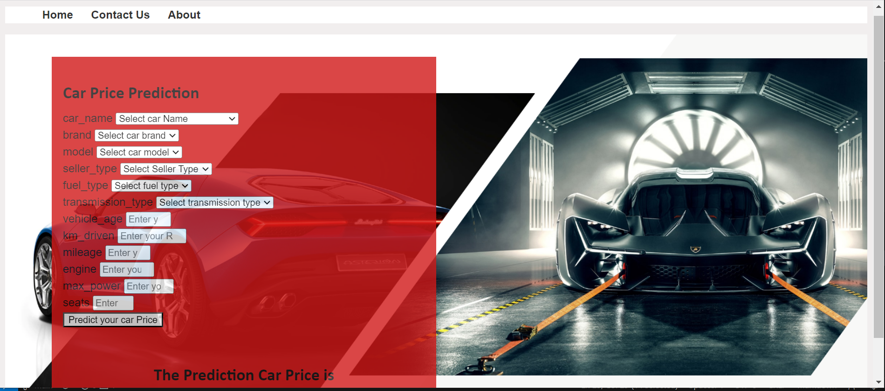

# Car Price Prediction - Bhuvana Chandra

### Introduction About the Data :

**The dataset** The goal is to predict `Car Price`.

There are 13 independent variables (including `selling_price`):

* `car_name` : Car's Full name, which includes brand and specific model name.
* `brand` : Brand Name of the particular car.
* `model` : Exact model name of the car of a particular brand.
* `vehicle_age` : The count of years since car was bought.
* `km_driven` : Total no of Kilometers which was driven.
* `seller_type` : Which Type of seller is selling the used car.
* `fuel_type` : Fuel used in the used car, which was put up on sale.
* `transmission_type` : Transmission used in the used car, which was put on sale.
* `mileage` : It is the number of kilometer the car runs per litre.
* `engine` : It is the engine capacity in cc(cubic centimeters)
* `max_power` : Max power it produces in BHP.
* `seats` : Total number of seats in car.

Target variable:
* `selling_price`: The sale price which was put up on website.

Dataset Source Link :
https://www.kaggle.com/datasets/manishkr1754/cardekho-used-car-data

# Screenshot of UI

# Approach for the project 

1. Data Ingestion : 
    * In Data Ingestion phase the data is first read as csv. 
    * Then the data is split into training and testing and saved as csv file.

2. Data Transformation : 
    * In this phase a ColumnTransformer Pipeline is created.
    * for Numeric Variables first SimpleImputer is applied with strategy median , then Standard Scaling is performed on numeric data.
    * for Categorical Variables SimpleImputer is applied with most frequent strategy, then ordinal encoding performed , after this data is scaled with Standard Scaler.
    * This preprocessor is saved as pickle file.

3. Model Training : 
    * In this phase base model is tested . The best model found was catboost regressor.
    * After this hyperparameter tuning is performed on catboost and knn model.
    * A final VotingRegressor is created which will combine prediction of catboost, xgboost and knn models.
    * This model is saved as pickle file.

4. Prediction Pipeline : 
    * This pipeline converts given data into dataframe and has various functions to load pickle files and predict the final results in python.

5. Flask App creation : 
    * Flask app is created with User Interface to predict the gemstone prices inside a Web Application.

# Exploratory Data Analysis Notebook

Link : [EDA Notebook](./notebook/1_EDA STUDENT PERFORMANCE .ipynb)

# Model Training Approach Notebook

Link : [Model Training Notebook](./notebook/2_MODEL TRAINING.ipynb)